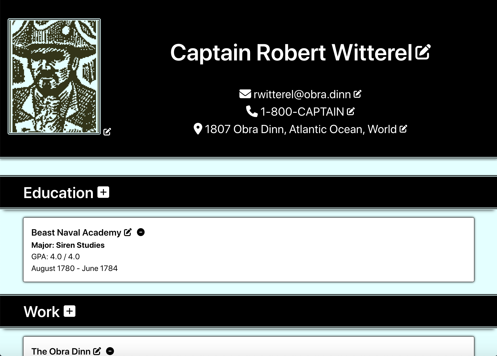

# CV Application

## Introduction

This project is a webpage of an editable CV application. It uses the React framework and was bootstrapped with [Create React App](https://github.com/facebook/create-react-app).

The project primarily demonstrates use of basic structures in React, including elements, components, props, and state, in order to build a functional user interface.

A word of warning! This webpage may contain spoilers for the amazing video game [Return of the Obra Dinn](https://obradinn.com/).

## Preview

Run this project [here](https://xsherryhe.github.io/cv-application/).

## Image Credits

1. Witterel.png -- https://obradinn.fandom.com/wiki/Robert_Witterel
